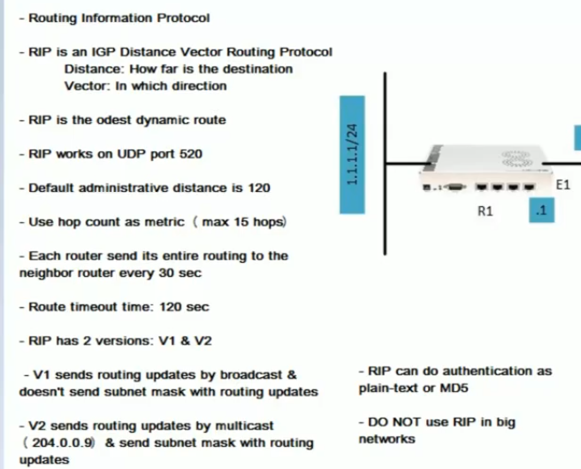
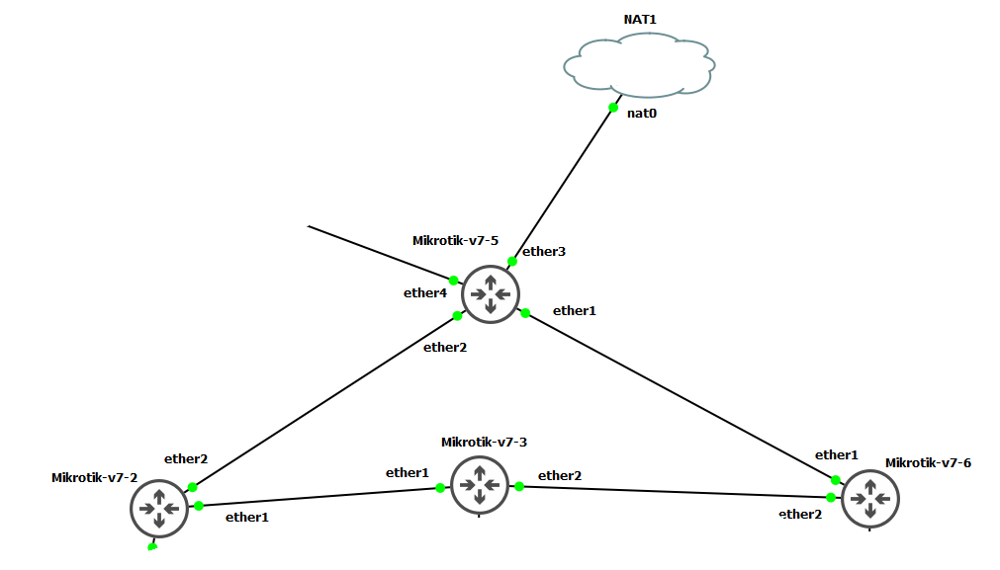

# RIP - on router os version7






## R6
```
system/identity/set name=R6

/ip address
add address=10.10.36.6/24 interface=ether2 network=10.10.36.0


/ip address
add address=10.10.56.6/24 interface=ether1 network=10.10.56.0


/routing rip instance
add afi=ipv4 disabled=no name=rip-instance-1 redistribute=connected,rip routing-table=main vrf=main


/routing rip interface-template
add disabled=no instance=rip-instance-1 interfaces=ether1,ether2 \
    poison-reverse=yes split-horizon=yes


```


## R2
```
system/identity/set name=R2

/ip address
add address=10.10.23.2/24 interface=ether1 network=10.10.23.0

/ip address
add address=10.10.25.2/24 interface=ether2 network=10.10.25.0


/routing rip instance
add afi=ipv4 disabled=no name=rip-instance-1 redistribute=connected,rip routing-table=main vrf=main


/routing rip interface-template
add disabled=no instance=rip-instance-1 interfaces=ether1,ether2 \
    poison-reverse=yes split-horizon=yes


```


## R3
```
system/identity/set name=R3


/ip address
add address=10.10.23.3/24 interface=ether1 network=10.10.23.0


/ip address
add address=10.10.36.3/24 interface=ether2 network=10.10.36.0


/routing rip instance
add afi=ipv4 disabled=no name=rip-instance-1 redistribute=connected,rip routing-table=main vrf=main


/routing rip interface-template
add disabled=no instance=rip-instance-1 interfaces=ether1,ether2 \
    poison-reverse=yes split-horizon=yes


```


## R5

```

system/identity/set name=R5


/ip address
add address=10.10.25.5/24 interface=ether2 network=10.10.25.0


/ip address
add address=10.10.56.5/24 interface=ether1 network=10.10.56.0


ip dhcp-client/set interface=ether3 add-default-route=yes use-peer-dns=yes use-peer-ntp=yes number=0


/routing rip instance
add afi=ipv4 disabled=no name=rip-instance-1 originate-default=always \
    redistribute=connected,rip routing-table=main vrf=main


/routing rip interface-template
add disabled=no instance=rip-instance-1 interfaces=ether1,ether2 \
    poison-reverse=yes split-horizon=yes


```
