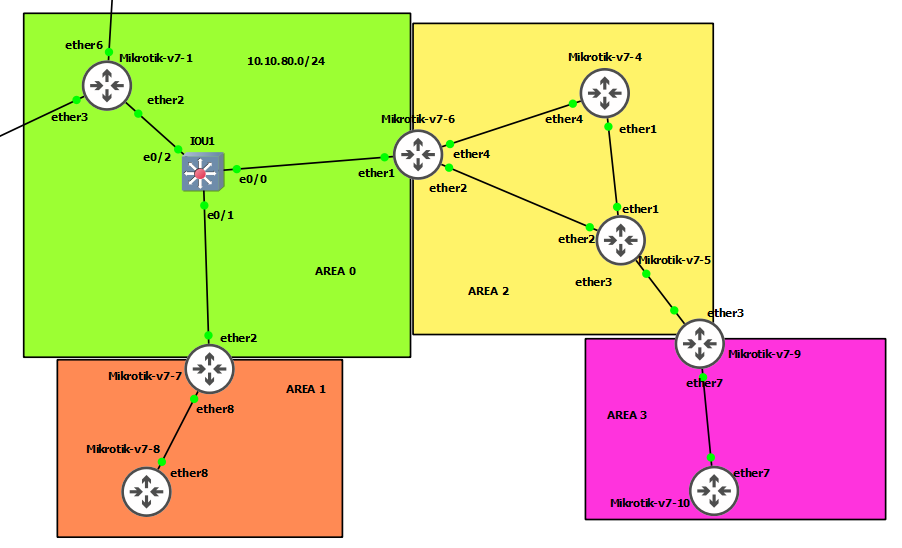

# ospf on rousteros v7




## R1
```
system/identity/set name=R1

/ip address
add address=10.10.80.1/24 interface=ether2 network=10.10.80.0

/interface bridge
add name=loopback0


/ip address
add address=1.1.1.1 interface=loopback0 network=1.1.1.1


ip dhcp-client/set interface=ether6 add-default-route=yes use-peer-dns=yes use-peer-ntp=yes numbers=0


/routing id
add disabled=no id=1.1.1.1 name=id-1 select-dynamic-id=""

/routing ospf instance
add disabled=no name=ospf-instance-1 router-id=id-1 routing-table=main

/routing ospf area
add disabled=no instance=ospf-instance-1 name=area0

/routing ospf interface-template
add area=area0 disabled=no interfaces=ether2 networks=10.10.80.0/24
add area=area0 disabled=no interfaces=loopback0 networks=1.1.1.1/32


```


## R6

```
system/identity/set name=R6


/ip address
add address=10.10.56.6/24 interface=ether2 network=10.10.56.0


/ip address
add address=10.10.80.6/24 interface=ether1 network=10.10.26.0

/ip address
add address=10.10.46.6/24 interface=ether4 network=10.10.46.0


/routing id
add disabled=no id=6.6.6.6 name=id-1 select-dynamic-id=""

/routing ospf instance
add disabled=no name=ospf-instance-1 router-id=id-1 routing-table=main


/routing ospf area
add disabled=no instance=ospf-instance-1 name=area0
add area-id=0.0.0.2 disabled=no instance=ospf-instance-1 name=area2


/routing ospf interface-template
add area=area0 disabled=no interfaces=ether1 networks=10.10.80.0/24
add area=area2 disabled=no interfaces=ether4 networks=10.10.46.0/24
add area=area2 disabled=no interfaces=ether2 networks=10.10.56.0/24

```


## R4

```
system/identity/set name=R4

/ip address
add address=10.10.46.4/24 interface=ether4 network=10.10.46.0


/ip address
add address=10.10.45.4/24 interface=ether1 network=10.10.45.0


/routing id
add disabled=no id=4.4.4.4 name=id-1 select-dynamic-id=""

/routing ospf instance
add disabled=no name=ospf-instance-1 router-id=id-1 routing-table=main


/routing ospf area
add area-id=0.0.0.2 disabled=no instance=ospf-instance-1 name=area2


/routing ospf interface-template
add area=area2 disabled=no interfaces=ether4 networks=10.10.46.0/24
add area=area2 disabled=no interfaces=ether1 networks=10.10.45.0/24

```

## R5

```

system/identity/set name=R5


/ip address
add address=10.10.56.5/24 interface=ether2 network=10.10.56.0


/ip address
add address=10.10.45.5/24 interface=ether1 network=10.10.45.0


/ip address
add address=10.10.59.5/24 interface=ether3 network=10.10.59.0


/routing id
add disabled=no id=5.5.5.5 name=id-1 select-dynamic-id=""

/routing ospf instance
add disabled=no name=ospf-instance-1 router-id=id-1 routing-table=main


/routing ospf area
add area-id=0.0.0.2 disabled=no instance=ospf-instance-1 name=area2


/routing ospf interface-template
add area=area2 disabled=no interfaces=ether2 networks=10.10.56.0/24
add area=area2 disabled=no interfaces=ether1 networks=10.10.45.0/24
add area=area2 disabled=no interfaces=ether3 networks=10.10.59.0/24


```


## R9

```

system/identity/set name=R9
/ip address
add address=10.10.59.9/24 interface=ether3 network=10.10.59.0


/ip address
add address=10.10.109.9/24 interface=ether7 network=10.10.109.0


/routing id
add disabled=no id=9.9.9.9 name=id-1 select-dynamic-id=""

/routing ospf instance
add disabled=no name=ospf-instance-1 router-id=id-1 routing-table=main


/routing ospf area
add area-id=0.0.0.2 disabled=no instance=ospf-instance-1 name=area2
add area-id=0.0.0.3 disabled=no instance=ospf-instance-1 name=area3


/routing ospf interface-template
add area=area3 disabled=no interfaces=ether7 networks=10.10.109.0/24
add area=area2 disabled=no interfaces=ether3 networks=10.10.59.0/24


```

## R10

```
system/identity/set name=R10
/ip address
add address=10.10.109.10/24 interface=ether7 network=10.10.109.0


/routing id
add disabled=no id=10.10.10.10 name=id-1 select-dynamic-id=""

/routing ospf instance
add disabled=no name=ospf-instance-1 router-id=id-1 routing-table=main


/routing ospf area
add area-id=0.0.0.3 disabled=no instance=ospf-instance-1 name=area3


/routing ospf interface-template
add area=area3 disabled=no interfaces=ether7 networks=10.10.109.0/24


```


## R7

```

system/identity/set name=R7
/ip address
add address=10.10.80.7/24 interface=ether2 network=10.10.80.0


/ip address
add address=10.10.78.7/24 interface=ether8 network=10.10.78.0


/routing id
add disabled=no id=7.7.7.7 name=id-1 select-dynamic-id=""

/routing ospf instance
add disabled=no name=ospf-instance-1 router-id=id-1 routing-table=main


/routing ospf area
add disabled=no instance=ospf-instance-1 name=area0
add area-id=0.0.0.1 disabled=no instance=ospf-instance-1 name=area1


/routing ospf interface-template
add area=area0 disabled=no interfaces=ether2 networks=10.10.80.0/24
add area=area1 disabled=no interfaces=ether8 networks=10.10.78.0/24


```


## R8
```
system/identity/set name=R8

/ip address
add address=10.10.78.8/24 interface=ether8 network=10.10.78.0


/routing id
add disabled=no id=8.8.8.8 name=id-1 select-dynamic-id=""

/routing ospf instance
add disabled=no name=ospf-instance-1 router-id=id-1 routing-table=main


/routing ospf area
add area-id=0.0.0.1 disabled=no instance=ospf-instance-1 name=area1


/routing ospf interface-template
add area=area1 disabled=no interfaces=ether8 networks=10.10.78.0/24


```

